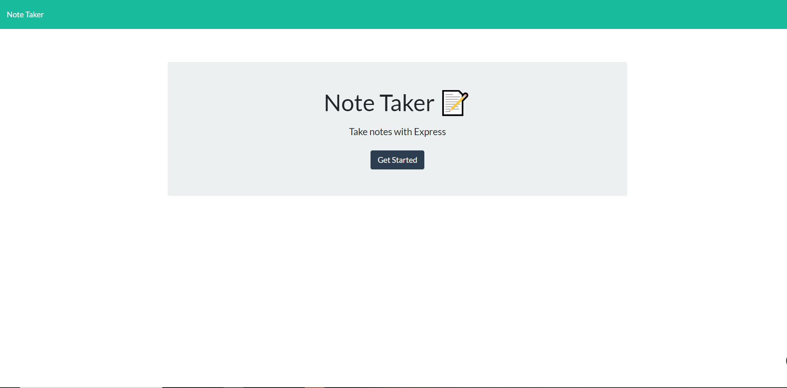
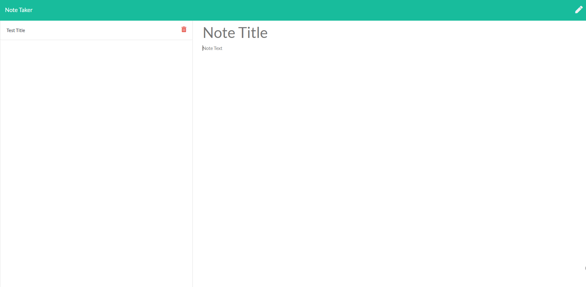
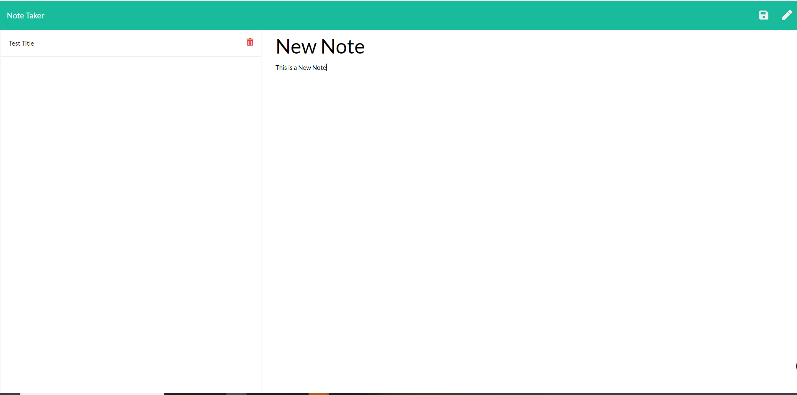
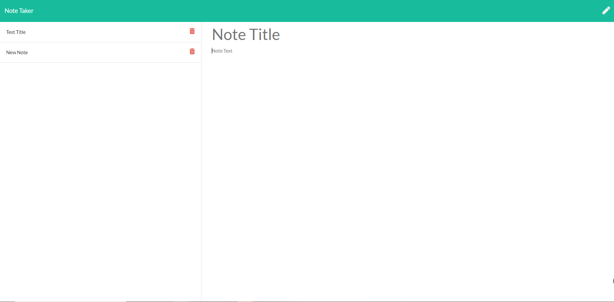

# Note Taker Starter Code

## Table of Contents

* [Description](#Description)
* [Usage](#Usage)
* [License](#License)
* [Contributing](#Contributing)

## Description
This is a notetaking application that will take in:

* A title for the notes
* The text for each individual notes

which will then be kept as an object into the JSON file using the POST method and can later be called upon using the GET method.

## Usage
If you wish to test out the application you can open it up <a href = "https://note-takaa.herokuapp.com/">here</a>

When you initialize the application you will be brought to the initial page which will let you start the application

Once you are in the application you will be brought to the notes section which you can add individual notes and save them by clicking the top right save button (floppy disk) that will pop up after adding in the note. These notes will also be reflected in the sidebar on the left. Each of these list items can then be clicked to refer back to the original note that was written.

If the note is no longer needed then you can look at the list item for the delete button (trashcan icon) on the right to utilize the DELETE method and remove it from the JSON file. 

## License
MIT  

## Badges

## Contributing
For anyone who wishes to contribute you can contact me with the information below

Would you like to reach us?
 
Contact Me:

Github: https://github.com/aznjp

Email: Jpark103193@gmail.com